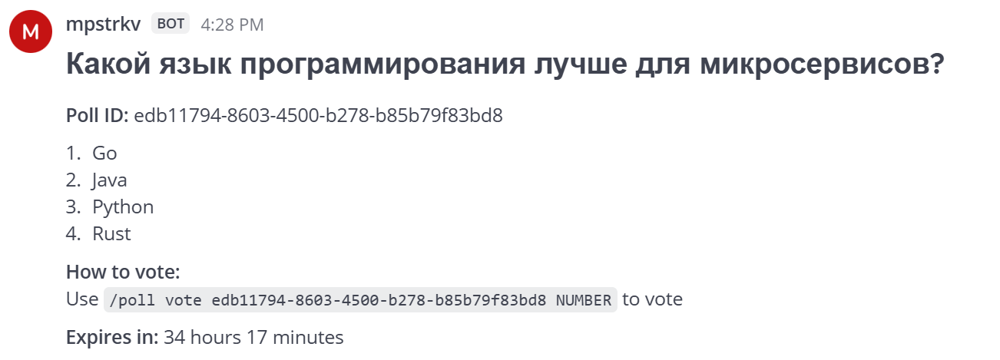
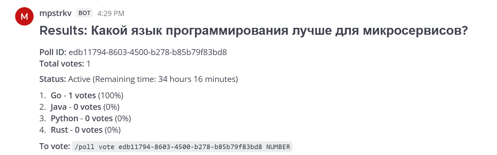
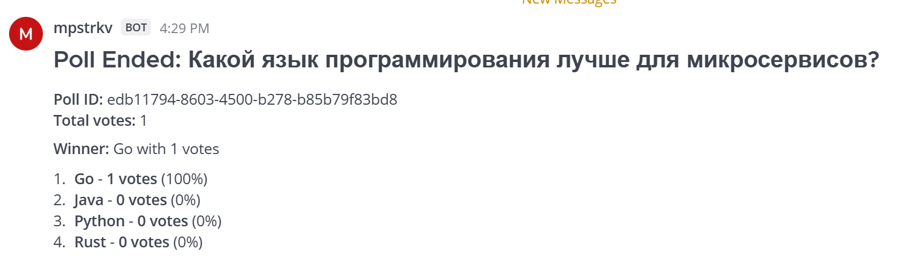
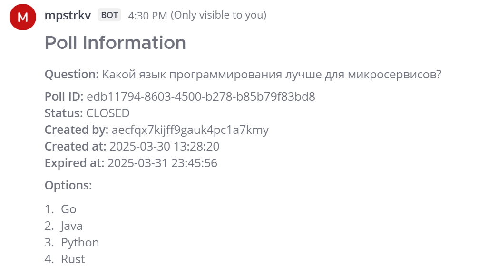
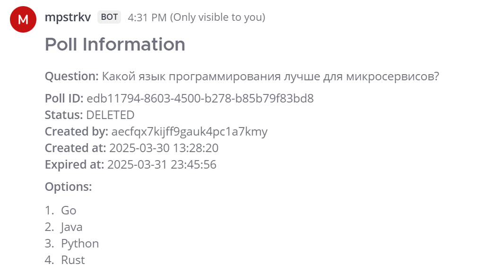

# Бот для голосований в Mattermost

Этот сервис представляет собой интеграцию с Mattermost для создания и управления голосованиями внутри каналов при помощи slash-команд. Пользователи могут создавать опросы, голосовать, просматривать результаты и управлять жизненным циклом голосований.

## Технологический стек

### Основные технологии
- **Go 1.24**
- **Tarantool**
- **Docker & Docker Compose**
- **Chi Router**
- **Mattermost API**

### Вспомогательные библиотеки
- **zerolog**
- **viper**
- **go-playground/validator**
- **gomock**
- **swaggo/swag**


# Инструкция по установке и настройке бота для голосований в Mattermost

## Установка и запуск

### Шаг 1: Клонирование репозитория
```bash
git clone https://github.com/mihailpestrikov/vk-test-assignment-mattermost-polls
cd vk-test-assignment-mattermost-polls
```

### Шаг 2: Настройка переменных окружения
Создайте файл `.env` в корне проекта со следующим содержимым:
```
HOST=0.0.0.0
PORT=8080
REQUEST_TIMEOUT=30
GIN_MODE=release
APP_ENV=production

LOG_LEVEL=info

TARANTOOL_HOST=tarantool
TARANTOOL_PORT=3301
TARANTOOL_USER=guest
TARANTOOL_PASS=testpass
TARANTOOL_SPACE_POLLS=polls
TARANTOOL_SPACE_VOTES=votes

MATTERMOST_URL=http://mattermost:8065
MATTERMOST_TOKEN=
MATTERMOST_WEBHOOK_SECRET=

DEFAULT_POLL_DURATION=86400
MAX_OPTIONS=10
```
*(значения MATTERMOST_TOKEN и MATTERMOST_WEBHOOK_SECRET будут заполнены позже)*

### Шаг 3: Запуск контейнеров
```bash
make dev
```

## Настройка Mattermost

### Шаг 4: Создание первого пользователя в Mattermost
1. Откройте браузер и перейдите на http://localhost:8065
2. Заполните форму регистрации (первый пользователь автоматически становится системным администратором)

### Шаг 5: Создание токена для бота
1. Перейдите в меню (левый верхний угол)
2. Выберите "Integrations" - "Bot accounts"
3. По подсказке нужно разрешить создание бот-аккаунтов в System Console
4. Нажмите "Add bot account", заполните поля, done
5. Скопируйте созданный токен 
6. Добавьте этот токен в файл `.env`

### Шаг 6: Настройка slash-команды
1. Перейдите в "Slash commands"
2. Нажмите "Add Slash command"
3. Заполните форму:
    - Заголовок: Poll Bot
    - Описание: Bot for polls
    - Команда: poll
    - URL запроса: http://poll-bot:8080/command
    - Метод: POST
4. Сохраните команду и скопируйте созданный токен
5. Добавьте этот токен в файл `.env`

### Шаг 7: Перезапуск бота с новыми токенами
```bash
make stop
make dev
```

## Использование бота

Теперь вы можете использовать следующие команды в любом канале Mattermost:

- `/poll create "Вопрос" "Вариант1" "Вариант2" "Вариант3"` - создание голосования
- `/poll vote [poll_id] [option_index]` - голосование (индексы вариантов начинаются с 1)
- `/poll results [poll_id]` - просмотр текущих результатов
- `/poll end [poll_id]` - завершение голосования
- `/poll delete [poll_id]` - удаление голосования
- `/poll info [poll_id]` - получение информации о голосовании
- `/poll help` - получение справки

## Примеры использования бота

### Создание голосования
Команда:
```
/poll create "Какой язык программирования лучше для микросервисов?" "Go" "Java" "Python" "Rust" --duration=86400
```

Вывод:


### Голосование
Команда:
```
/poll vote 5fa3d8e6-7b21-4f4a-9c5e-b7d58c9874a2 1
```

Вывод (виден только проголосовавшему):


### Просмотр результатов
Команда:
```
/poll results 5fa3d8e6-7b21-4f4a-9c5e-b7d58c9874a2
```

Вывод (для автора голосования - виден всем, для участника - только проголосовавшему:


### Завершение голосования
Команда:
```
/poll end 5fa3d8e6-7b21-4f4a-9c5e-b7d58c9874a2
```

Вывод:


### Информация о голосовании
Команда:
```
/poll info 5fa3d8e6-7b21-4f4a-9c5e-b7d58c9874a2
```

Вывод (только запросившему):


### Удаление голосования
Команда:
```
/poll delete 5fa3d8e6-7b21-4f4a-9c5e-b7d58c9874a2
```

Вывод (виден только создателю):



### Справка по командам
Команда:
```
/poll help
```

Вывод:
```
Available commands:

/poll create "Question" "Option 1" "Option 2" [--duration=86400]
    Create a new poll with specified options and optional duration in seconds

/poll vote POLL_ID OPTION_NUMBER
    Vote for an option in the specified poll

/poll results POLL_ID
    Show current results of the poll

/poll end POLL_ID
    End the poll and show final results (only creator can end)

/poll delete POLL_ID
    Delete the poll (only creator can delete)

/poll info POLL_ID
    Show detailed information about the poll

/poll help
    Show this help message
```


# Особенности реализации сервиса

## Фоновые процессы

### Автоматическое завершение голосований

Бот реализует механизм автоматического завершения голосований, срок действия которых истек. Это достигается с помощью фонового процесса, работающего в отдельной горутине:

```go
func (s *PollService) StartPollWatcher(ctx context.Context) {
    go func() {
        ticker := time.NewTicker(1 * time.Minute)
        defer ticker.Stop()

        for {
            select {
            case <-ticker.C:
                s.FinishExpiredPolls()
            case <-ctx.Done():
                return
            }
        }
    }()
}
```

Процесс запускается при старте приложения и каждую минуту проверяет наличие голосований с истекшим сроком. Когда такие голосования обнаруживаются, их статус автоматически изменяется на "CLOSED", и пользователи больше не могут в них голосовать.

### Очистка удаленных голосований

В системе используется soft delete для голосований. Когда пользователь удаляет голосование, оно не удаляется физически из базы данных, а помечается статусом "DELETED". Для периодической очистки таких записей реализован специальный механизм:

```go
func (s *PollService) StartPollCleaner(ctx context.Context) {
    go func() {
        ticker := time.NewTicker(24 * time.Hour) // Запуск раз в сутки
        defer ticker.Stop()

        for {
            select {
            case <-ticker.C:
                s.repo.PurgeDeletedPolls(30 * 24 * time.Hour) // Удаление записей старше 30 дней
            case <-ctx.Done():
                return
            }
        }
    }()
}
```

Этот процесс запускается один раз в сутки и удаляет из базы данных голосования, которые были помечены как удаленные более 30 дней назад. Такой подход позволяет:

1. Сохранять возможность восстановления недавно удаленных голосований
2. Предотвращать неограниченный рост базы данных


### Структура проекта

```
.
├── cmd                 # Точки входа приложения
│   └── pollbot         # Основной сервис
├── docker              # Файлы для Docker контейнеров
│   ├── bot             # Dockerfile для сервиса
│   └── tarantool       # Dockerfile и скрипты для Tarantool
├── docs                # Документация API (Swagger)
├── internal            # Внутренние пакеты
│   ├── api             # HTTP обработчики
│   │   └── dto         # Объекты передачи данных
│   ├── model           # Бизнес-модели
│   ├── repository      # Слой доступа к данным
│   └── service         # Бизнес-логика
├── pkg                 # Повторно используемые пакеты
│   ├── config          # Конфигурация приложения
│   ├── logger          # Логирование
│   └── mattermost      # Интеграция с Mattermost
└── Makefile            # Команды для управления проектом
```


### Тестирование

Покрытие тестами:

| Пакет | Покрытие |
|-------|----------|
| internal/model | 96.4% |
| internal/service | 87.3% |
| pkg/mattermost | 83.4% |
| internal/api | 67.3% |


### Проблемы с зависимостью Tarantool

При попытке запустить тесты и линтер возникают ошибки, связанные с библиотекой github.com/tarantool/go-openssl:

```
undefined: Ctx
undefined: Conn
```
У меня не получилось их решить, не смотря на обновления пакетов. Запускал тесты и линтер отдельно для каждого пакета, исключив проблемные модули


## Команды Makefile

```bash
# Сборка Docker-образов
build:
	docker-compose build

# Сборка только образа бота
build-bot:
	docker-compose build poll-bot

# Запуск только бота и Tarantool
make run

# Запуск с Mattermost для разработки
make dev

# Остановка всех контейнеров
make stop

# Полная очистка
make clean

# Запуск тестов с отчетом о покрытии
make test-cover

# Запуск линтера (исключая проблемные пакеты)
make lint
```